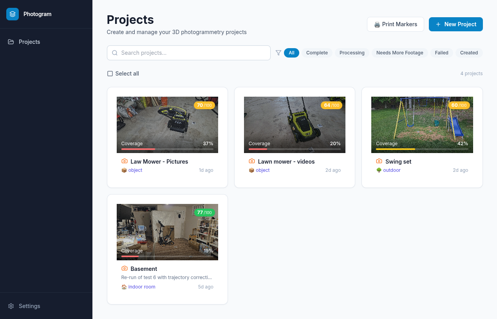
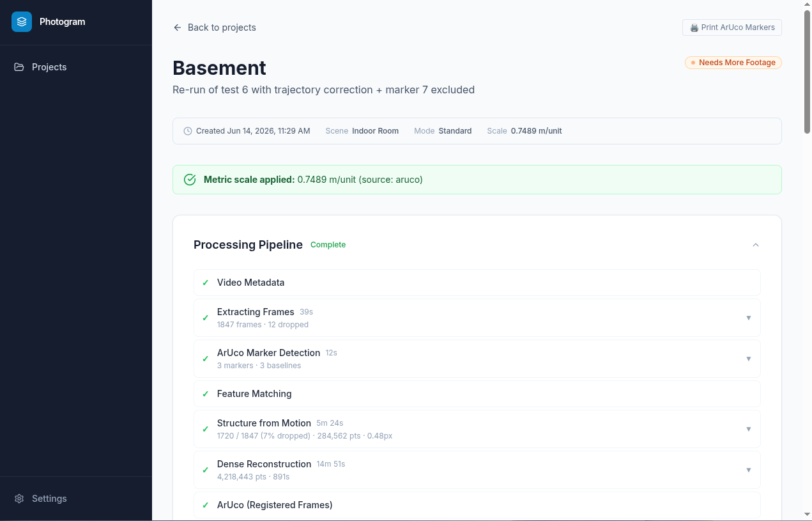
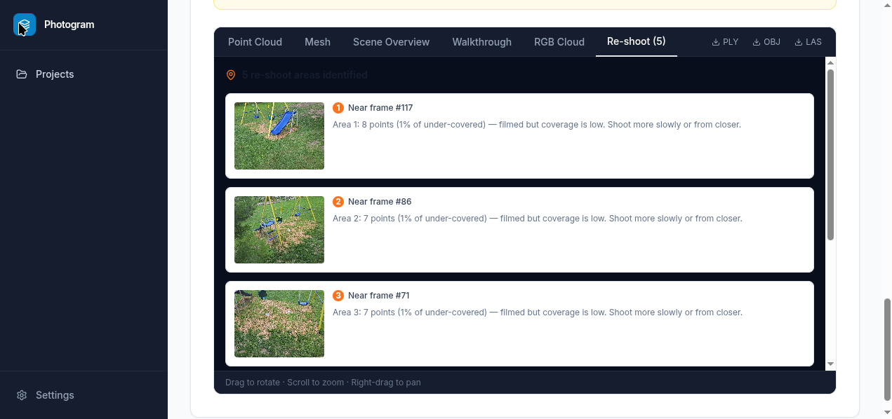
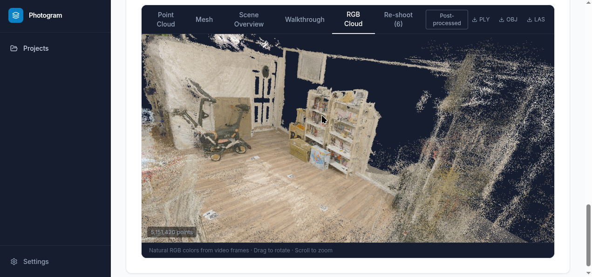
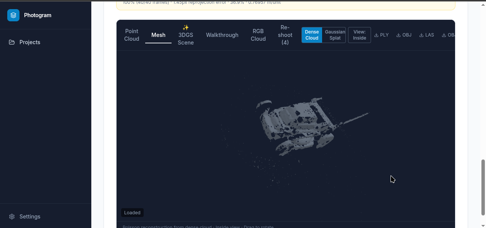
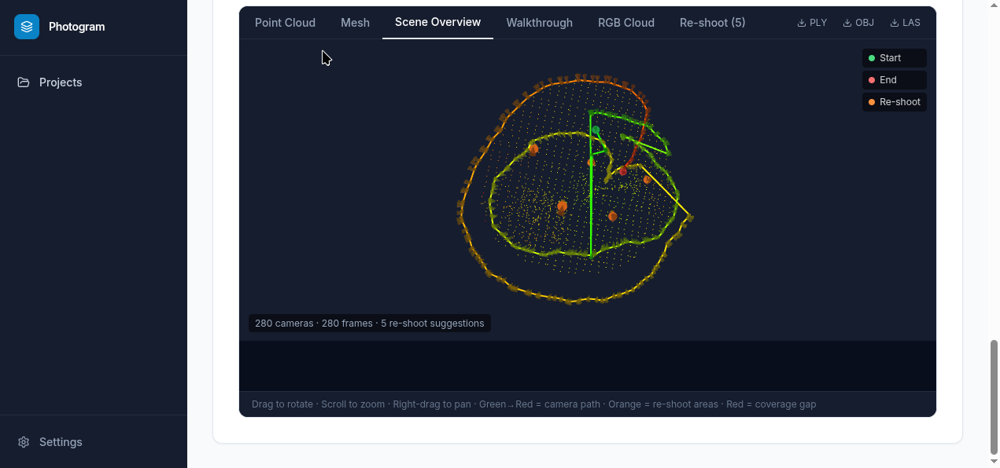

# Photogram

> **Thermovation AI tool** — a clone of Photogram, with Thermovation features built on top of it:
> choice of scale marker (ArUco or a custom 3×3 grid sheet), LiDAR `.ply` ingestion, automatic room
> dimensions (L × B × H) for every input, MetricAnything depth-fusion densification, and HVAC wall-mount
> placement shown on photos and in the 3D viewer. See [What Thermovation adds](#what-thermovation-adds).
> Everything below that section describes the Photogram base it was cloned from.

A research testbed for exploring where vision-language models can add meaningful value inside an established computer vision pipeline. The domain is photogrammetry — a well-understood, well-tooled process for reconstructing 3D geometry from images — chosen precisely because the baseline is solid enough that any VLM contribution can be evaluated against a known-good result.

The core question: **in a pipeline where the geometry is already handled by classical methods (feature matching, SfM, MVS), where does a VLM actually help — and where does it get in the way?**

---

## What this is

A fully working photogrammetry pipeline across three scene modes — indoor room, outdoor survey, object orbit — built as a platform for running experiments. Video or photos in, metric-scaled dense point cloud, mesh, and Gaussian splat out. The pipeline is production-quality and runs end-to-end automatically, which is what makes it a useful testbed: results are comparable across approaches, and the cost of a failed experiment is just one pipeline run.

The system went through several major phases of VLM integration before arriving at its current form. VLMs were explored for scene classification, scale-reference detection (Grounding DINO + LLaVA), depth map alignment (Depth Anything v2), and reconstruction quality validation.

The headline finding: **VLM output is too inconsistent to trust in an automated pipeline without a human in the loop.** Every integration hit the same wall — correct output most of the time, confidently wrong output the rest, with no reliable signal to distinguish them. Adding a human confirmation gate after each VLM step kills the automation; accepting silent failures degrades output in ways that are hard to debug.

The deeper finding was about problem framing. VLMs were applied to compensate for missing information (a length reference absent from the footage). That is an *information* problem, not a perception problem. The right fix was to put the reference in the scene before filming — printed ArUco markers — rather than infer it afterward. A consistent physical process turned out to be less frustrating, faster, and more accurate than any AI approach.

The [development journey](docs/journey.md) documents each experiment in full: what was tried, what failed, and what was learned.

---

## What Thermovation adds

| Feature | What it does | Where |
|---------|--------------|-------|
| **Scale marker choice** | Pick per project: printed ArUco markers, or the custom 3×3 grid sheet (28.6 × 20.2 cm, 9 black squares). Grid scale = similarity fit of the 9 triangulated square centres to the known layout | `grid_marker_detector.py`, `grid_marker_scale.py` |
| **LiDAR upload** | Upload an already-built `.ply` (iPhone/iPad LiDAR, scanner). Short chain: ingest → refine → export; scale trusted from the scanner (optional factor, e.g. 0.001 for mm) | `lidar_ingest.py` |
| **Room dimensions** | Length × breadth × height (+ footprint, volume) for ArUco, grid and LiDAR scans. Floor found from the cloud when no marker floor exists. Optional tape-measure ground truth → per-field error % | `dimensions.py`, `DimensionsCard.tsx` |
| **MetricAnything densifier** | Optional. Monocular metric depth per frame, calibrated against the COLMAP cloud, TSDF-fused; fills gaps as a separate cloud/mesh | `metricanything_fusion.py` |
| **HVAC placement** | Optional, indoor. ADE20K walls → GDINO(+SAM2) fixtures → Rücklauf/Vorlauf (blue/red cap) → ranked 60×40 cm mounting spots. Shown in a *Segmentation* tab (photos) and drawn in 3D on the Point Cloud / Mesh tabs | `wall_plane_detection.py`, `detect_hvac_fixtures.py`, `locate_rucklauf.py`, `hvac_placement.py`, `lib/hvacOverlay.ts` |

Optional stages are gated twice: an environment master switch (`ENABLE_METRICANYTHING_FUSION`, `ENABLE_HVAC_PLACEMENT`) **and** a per-project checkbox at creation.

Thermovation-only pipeline (in addition to the base chain below):

```
Video (ArUco or grid marker):
  … → detect_aruco (ArUco or grid, per project) → … → refine_cloud
    → [lingbot_fusion] → [metricanything_fusion]
    → [wall_plane_detection → detect_hvac_fixtures → locate_rucklauf → hvac_placement]   (indoor)
    → coverage → export (+ dimensions)

LiDAR .ply:
  ingest_lidar_ply → refine_cloud → export (+ dimensions)
```

Fixes made in this clone that the Photogram base does not have: frame extraction no longer drops
`scene_type` / ground truth / excluded marker IDs; gravity is read from the real camera poses; opposite
walls are no longer merged as duplicates; densifiers no longer default to the `object` clip; reprocess
keeps earlier stage results and restores the scaled cloud; `backend/core/storage.py` is included.

---

## Current pipeline

The geometry pipeline is classical throughout. Scale is solved by a physical reference (printed ArUco markers) rather than AI inference. Three scene modes are supported — indoor room, outdoor, object — each with its own pipeline branch and mesh reconstruction algorithm.

```
extract_metadata → extract_frames → detect_aruco (FAIL FAST) →
feature_matching → sfm → mvs →
[gaussian_splatting — object only] →
[correct_trajectory_jumps — indoor/outdoor only] →
detect_aruco_sfm → scale_from_aruco → apply_known_scale →
[fill_planes — indoor only] → refine_cloud → coverage → export
```

Scout mode runs a trimmed version (no MVS) to calibrate parameters for the full run automatically. See [docs/operations.md](docs/operations.md) for stage-by-stage detail.

---

## Outputs

| Output | Detail |
|--------|--------|
| Dense point cloud | COLMAP MVS, up to 1M+ points |
| Mesh | Ball Pivoting (object/outdoor) or Poisson (indoor) with hole filling and Taubin smoothing |
| Gaussian Splat | nerfstudio splatfacto `.splat` file for in-browser 3DGS viewer (object mode) |
| Metric scale | ArUco triangulation, accurate to ~2% with 2+ co-visible markers |
| Coverage heatmap | Per-point visibility score via open3d HPR + DBSCAN, scene-type-aware suggestions |
| Re-shoot suggestions | 3D camera positions targeting under-covered areas, with quality vs angle diagnosis |
| Camera walkthrough | Step through real SfM camera poses with free-look rotate-in-place; blend the original video frame over the point cloud or mesh for ground-truth alignment comparison ([demo ↓](#camera-walkthrough)) |
| Room dimensions *(Thermovation)* | L × B × H, footprint, volume; optional ground-truth error check |
| HVAC placement *(Thermovation)* | Ranked wall-mount spots with photo overlay + 3D overlay |
| Densified cloud/mesh *(Thermovation)* | MetricAnything (and LingBot) depth fusion, separate artifacts |
| Formats | PLY, OBJ, LAS |

---

## Screenshots and demo

### Camera walkthrough

The walkthrough tab lets you step through actual SfM camera positions and overlay the original photo at each pose. Useful for spot-checking alignment, understanding where the reconstruction diverges from the real scene, and comparing point cloud vs mesh quality frame by frame.

<video src="docs/images/walkthrough.mp4" controls width="100%"></video>

> If the video doesn't render (e.g. on a plain markdown viewer), [download walkthrough.mp4](docs/images/walkthrough.mp4) directly.

### Interface screenshots

| Projects | Project detail | Re-shoot suggestions |
|----------|----------------|----------------------|
|  |  |  |

| RGB Point Cloud | Mesh | Scene Overview |
|-----------------|------|----------------|
|  |  |  |

---

## Quick Start

Requires a Linux host with an NVIDIA GPU (≥ 12 GB VRAM for object scans with Gaussian Splatting; 8 GB sufficient for indoor/outdoor only), Docker, and [NVIDIA CDI](https://docs.nvidia.com/datacenter/cloud-native/container-toolkit/latest/cdi-support.html) support.

```bash
git clone https://github.com/ramessri/thermovation_tool
cd thermovation_tool
cp .env.example .env          # set SECRET_KEY at minimum
docker compose -f docker-compose.prod.yml up -d
```

| Service | URL |
|---------|-----|
| App | http://localhost:3000 |
| API + Swagger | http://localhost:8000/docs |

Migrations (including the Thermovation ones, 013–016) run automatically when the prod API starts; with the dev `docker-compose.yml` run `docker compose exec api alembic upgrade head`.

**Before your first scan**, print ArUco markers (or use the 3×3 grid sheet — choose the marker when creating the project) and place them in the scene. LiDAR uploads need no marker:
```bash
docker compose -f docker-compose.prod.yml exec worker-gpu \
  python /app/scripts/generate_aruco_sheet.py
# → samples/aruco_sheet.pdf
```

---

## Scan modes

| Mode | What it does | When to use |
|------|-------------|-------------|
| **Standard** | Single full pipeline pass (~2 h on a typical scan) | Known-good footage |
| **Scout + Full** | Fast 40-frame calibration run (~15 min) that measures SfM registration rate and reprojection error, then tunes frame count (120–400), matching window (10–25), and MVS consistency threshold before firing the full run | First scan of a new scene |

The `/reprocess` API endpoint lets you re-run any post-MVS stage from the checkpoint saved after `detect_aruco_sfm` — useful when iterating on scale derivation or post-processing without re-running the hours-long COLMAP stages.

---

## Documentation

| Doc | What's inside |
|-----|---------------|
| [docs/journey.md](docs/journey.md) | The full research arc — every VLM approach tried, what failed, what was learned, and why |
| [docs/architecture.md](docs/architecture.md) | System design, C4 diagrams, data model, infrastructure |
| [docs/operations.md](docs/operations.md) | Pipeline theory — every stage explained, tunable parameters |
| [docs/contributing.md](docs/contributing.md) | Dev setup, adding stages, migrations, PR workflow |
| [CLAUDE.md](CLAUDE.md) | Up-to-date orientation incl. all Thermovation stages, env vars and quirks |

---

## Stack

| Layer | Tech |
|-------|------|
| Frontend | Next.js 15, Three.js PLY viewer, Tailwind CSS |
| API | FastAPI, async SQLAlchemy, WebSockets |
| Pipeline | Celery + Redis, CPU + GPU queues |
| Feature matching | LightGlue + DISK (GPU) |
| SfM | pycolmap incremental mapping |
| Dense recon | COLMAP CLI `patch_match_stereo` / `stereo_fusion` (CUDA) |
| Scale | ArUco (DICT_4X4_100) or 3×3 grid sheet + post-SfM triangulation; LiDAR native scale |
| Densification *(opt.)* | MetricAnything, LingBot-Map + open3d TSDF |
| HVAC *(opt.)* | SegFormer/ADE20K, Grounding DINO, SAM2 (transformers) |
| Geometry | open3d, numpy |
| Coverage | open3d HPR + DBSCAN |
| Exports | laspy (LAS), open3d (PLY/OBJ) |
| DB | PostgreSQL + SQLAlchemy async |
| Storage | Local FS (`STORAGE_BACKEND=local`; other backends not implemented) |

---

## Contributing

See [CONTRIBUTING.md](CONTRIBUTING.md) and the detailed [docs/contributing.md](docs/contributing.md).

## License

MIT — see [LICENSE](LICENSE).
