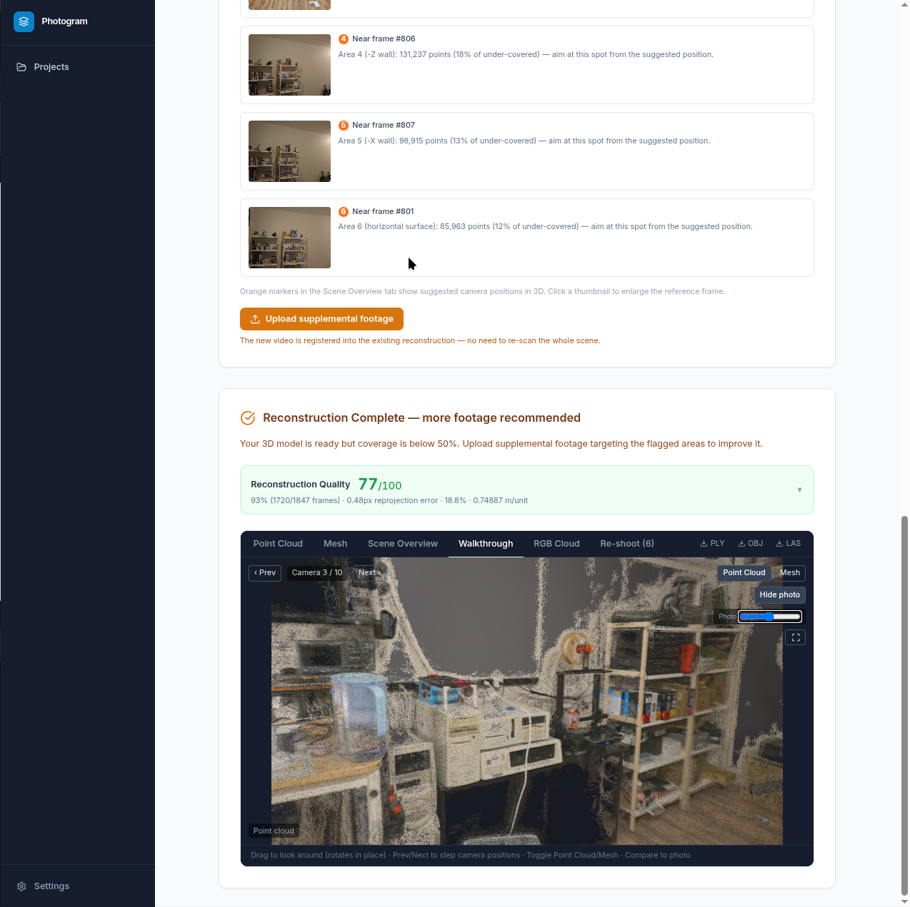

# Photogram Documentation

> **Thermovation AI tool** — this repository is a clone of Photogram with Thermovation features built on top (scale-marker choice incl. a 3×3 grid sheet, LiDAR `.ply` ingestion, room dimensions, MetricAnything densification, HVAC wall-mount placement). The Thermovation additions are summarised in the root [README](../README.md#what-thermovation-adds) and detailed in [operations.md § Thermovation stages](operations.md#thermovation-stages).

A research testbed for exploring where VLMs add value in a classical photogrammetry pipeline. The geometry is classical throughout — LightGlue, pycolmap, COLMAP MVS, open3d. The interesting question is what AI can contribute on top of that, and where it gets in the way.

## Camera walkthrough demo

One of the more useful features for evaluating reconstruction quality: step through actual SfM camera positions, rotate freely in place (FOV matched to the recording lens), and blend the original video frame over the point cloud or mesh. Lets you see precisely where the reconstruction deviates from the real scene.

<video src="images/walkthrough.mp4" controls width="100%"></video>

> [Download walkthrough.mp4](images/walkthrough.mp4) if the video doesn't render inline.

---

## Documentation index

| Document | Purpose |
|----------|---------|
| [architecture.md](architecture.md) | System design, C4 diagrams, data model, infrastructure |
| [operations.md](operations.md) | Pipeline theory — every stage explained, failure modes, tunable parameters |
| [contributing.md](contributing.md) | Dev setup, adding stages, migrations, PR workflow |
| [journey.md](journey.md) | Everything we tried, what worked, what we discarded and why |

---

## By audience

**Start here (the research arc) →** [journey.md](journey.md) — VLM experiments, what failed, what was learned  
**Just want to run it →** [../README.md](../README.md) Quick Start section  
**Understanding the pipeline →** [operations.md](operations.md)  
**Understanding the system →** [architecture.md](architecture.md)  
**Adding a feature / fixing a bug →** [contributing.md](contributing.md)  
