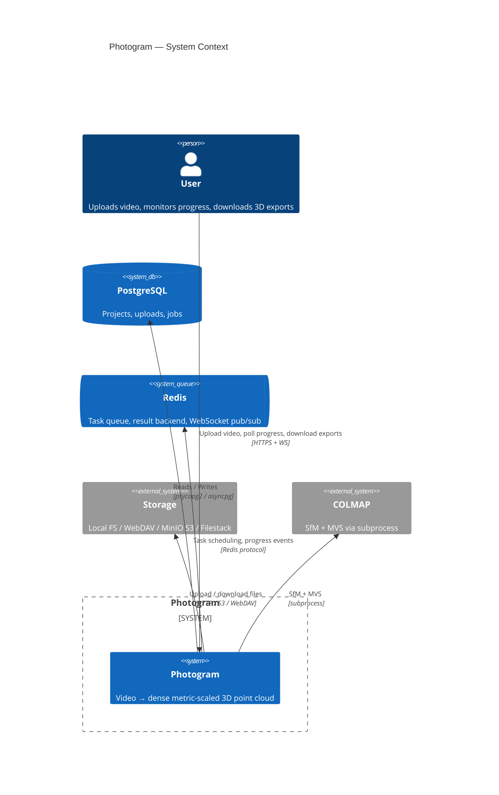
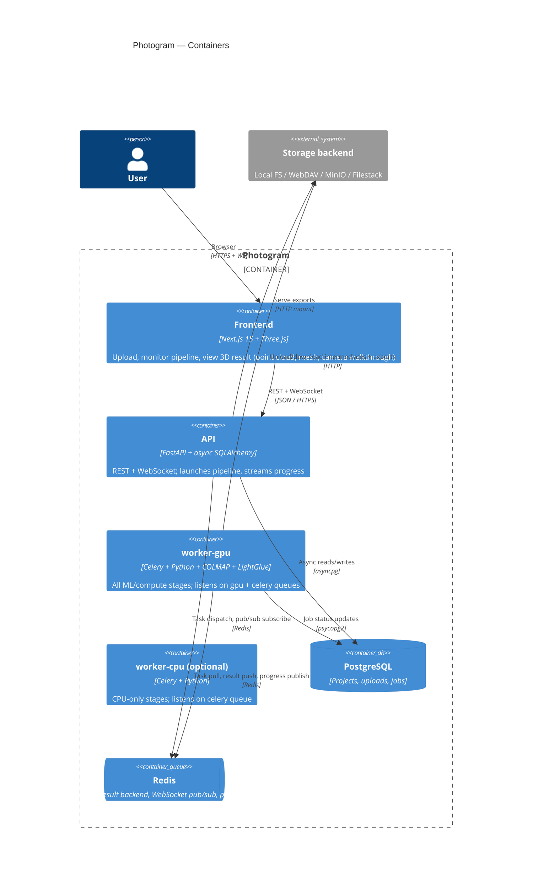
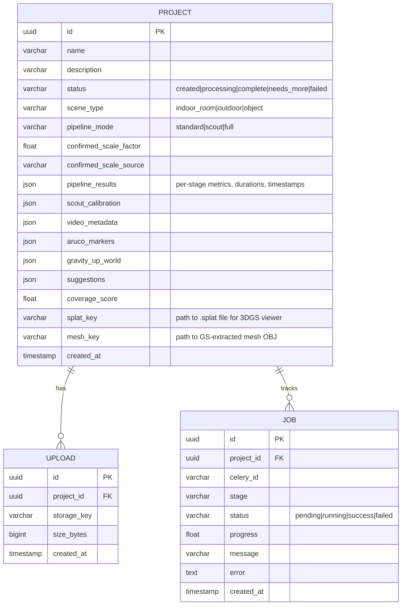

# Architecture

Photogram is a photogrammetry pipeline for GPU-equipped workstations: video or photos in, metric-scaled dense point cloud, mesh, and Gaussian splat out. Three scene modes are supported — `indoor_room`, `outdoor`, `object` — each with a separate pipeline branch, mesh reconstruction algorithm, and coverage boundary. The system scales to multi-worker deployments by adding Celery workers.

---

## System overview



---

## Container diagram



---

## Task routing

GPU-intensive stages are routed to the `gpu` queue (worker-gpu only). Everything else goes to the `celery` default queue, which worker-gpu also consumes. A dedicated `worker-cpu` is available for deployments that want to split CPU and GPU work across machines.

```
task_routes = {
    "pipeline.feature_matching":   {"queue": "gpu"},
    "pipeline.sfm":                {"queue": "gpu"},
    "pipeline.mvs":                {"queue": "gpu"},
    "pipeline.gaussian_splatting": {"queue": "gpu"},
    # all other stages → "celery" (default)
}
```

The routing lives exclusively in `celery_app.conf.task_routes` inside `backend/workers/tasks.py`. Do not use `.set(queue=)` on chain signatures — it does not reliably override `task_routes`.

---

## Pipeline chain

### Standard mode — indoor_room

```
extract_metadata → extract_frames → detect_aruco →
feature_matching → sfm → mvs →
correct_trajectory_jumps →
detect_aruco_sfm → scale_from_aruco → apply_known_scale →
fill_planes → refine_cloud → coverage → export
```

### Standard mode — outdoor

Same as indoor_room but `fill_planes` is skipped (terrain is not flat). Coverage boundary uses the 2D horizontal footprint of camera positions + height band instead of the full cloud.

### Standard mode — object

```
extract_metadata → extract_frames → detect_aruco →
feature_matching (all-pairs) → sfm → mvs →
gaussian_splatting →
detect_aruco_sfm → scale_from_aruco → apply_known_scale →
refine_cloud → coverage → export
```

`correct_trajectory_jumps` and `fill_planes` are skipped. `gaussian_splatting` is inserted after MVS. Feature matching uses all-pairs window (≥999) instead of the default sliding window of 15. Coverage boundary uses the 3D convex hull of camera positions.

### Thermovation additions

Video chains (any scene type) — the marker detected in `detect_aruco` / `detect_aruco_sfm` is the project's
`marker_type` (`aruco` or `grid`); `scale_from_aruco` derives scale from whichever it is. After `refine_cloud`:

```
refine_cloud → [lingbot_fusion] → [metricanything_fusion]
  → [wall_plane_detection → detect_hvac_fixtures → locate_rucklauf → hvac_placement]   (indoor_room only)
  → coverage → export   (export also computes L × B × H dimensions)
```

Bracketed stages run only when their env switch (`ENABLE_LINGBOT_FUSION`, `ENABLE_METRICANYTHING_FUSION`,
`ENABLE_HVAC_PLACEMENT`) **and** the per-project flag are on. All three are non-fatal.

LiDAR chain (`POST /launch?scan_source=lidar_ply`):

```
ingest_lidar_ply → refine_cloud → export
```

### Scout + Full mode

**Scout chain** (fast calibration, ~15 min):
```
extract_metadata → extract_frames → detect_aruco →
feature_matching → sfm → detect_aruco_sfm →
scale_from_aruco → scout_calibrate
```

`scout_calibrate` computes optimal parameters and synchronously calls `launch_full_pipeline()`, which dispatches the standard chain with calibrated `target_frames`, `match_window`, and `mvs_min_consistent`. The full chain runs as an independent Celery chain with its own task ID.

---


## Key API endpoints

| Method | Path | Purpose |
|--------|------|---------|
| `GET/POST` | `/api/projects/` | List + create projects |
| `GET` | `/api/projects/{id}` | Get project (includes `pipeline_results`, `pipeline_mode`, `scene_type`) |
| `PATCH` | `/api/projects/{id}` | Rename project (name, description) |
| `GET` | `/api/projects/{id}/uploads` | List all uploads for a project |
| `GET` | `/api/projects/{id}/jobs` | List all pipeline jobs with elapsed times |
| `POST` | `/api/projects/{id}/uploads` | Upload a video or image file |
| `POST` | `/api/projects/{id}/launch` | Launch pipeline (`?mode=standard\|scout`). Thermovation: `scan_source=video\|lidar_ply`, `lidar_scale_factor`, `ground_truth_length_m` / `_breadth_m` / `_height_m` |
| `POST` | `/api/projects/{id}/reprocess` | Re-dispatch downstream stages from a checkpoint (`?from_stage=scale_from_aruco\|fill_planes\|refine_cloud\|lingbot_fusion\|metricanything_fusion\|wall_plane_detection\|coverage\|export`, optional ground-truth params) |
| `POST` | `/api/projects/{id}/launch_supplemental` | Add footage to an existing reconstruction |
| `POST` | `/api/projects/{id}/cancel` | Revoke running pipeline |
| `GET` | `/files/{key}` | Serve storage files (video: H.264 transcoded via `/preview/video/{key}`) |
| `WS` | `/ws/projects/{id}/progress` | Real-time stage progress events (includes `stage_complete`, `heartbeat` with GPU stats) |

The `/reprocess` endpoint reads a checkpoint saved after `detect_aruco_sfm` completes and dispatches the downstream chain from any stage — useful for re-running geometry or export after a code fix without re-running SfM and MVS.

---

## Progress & WebSocket

Every stage task publishes to a Redis channel `project:{id}:progress`. The API subscribes and forwards to WebSocket clients. The last event is also cached at `project:{id}:last_progress` (24h TTL) so late-joining clients catch up immediately.

Heartbeat events are published every 15 seconds if no other event has been sent, carrying elapsed time and GPU stats. The frontend shows "stalled" if no event arrives within 3 min (fast stages) or 20 min (slow stages: mvs, sfm, feature_matching, gaussian_splatting).

---

## Data model



### Key project columns

| Column | Purpose |
|--------|---------|
| `status` | Lifecycle: `created → processing → complete / needs_more / failed` |
| `scene_type` | `indoor_room` · `outdoor` · `object` — controls pipeline branching, mesh algorithm, coverage boundary |
| `pipeline_mode` | Which chain ran: `standard`, `scout` (during calibration), `full` (during full run) |
| `confirmed_scale_factor` | Metric scale in m/SfM-unit, derived from ArUco triangulation |
| `pipeline_results` | JSON written by `emit_stage_complete()` after each stage: per-stage metrics, `_duration_s`, `_started_at`, `_finished_at`. Used by the frontend for page-reload display, quality scoring, and elapsed times. |
| `scout_calibration` | JSON from `compute_calibration()`: target_frames, match_window, mvs_min_consistent, scout metrics |
| `gravity_up_world` | World-space up vector derived from floor ArUco marker |
| `suggestions` | DBSCAN cluster positions for re-shoot guidance (scene-type-aware labels, angular-deduplicated) |
| `coverage_score` | 0–1 fraction of points with score ≥ 0.4 |
| `splat_key` | Storage path to the `.splat` file for the in-browser Gaussian Splat viewer |
| `mesh_key` | Storage path to the GS-extracted mesh OBJ (separate from the Poisson/BPA mesh in `exports/`) |
| `marker_type` *(Thermovation)* | `aruco` · `grid` — scale fiducial chosen at project creation |
| `scan_source` *(Thermovation)* | `video` · `lidar_ply` — set at launch |
| `dimensions` *(Thermovation)* | `{length_m, breadth_m, height_m, footprint_m2, volume_m3, ground_truth_check?}` from export |
| `metricanything_enabled` / `_cloud_key` / `_mesh_key` *(Thermovation)* | Per-project opt-in + densified artifacts |
| `hvac_mode` / `hvac_placement` / `hvac_segmentation` *(Thermovation)* | Per-project opt-in + ranked placements (with `corners_world_m`) + wall/fixture/Rücklauf detections |

---

## Mesh export pipeline

`backend/workers/pipeline/exporter.py` selects the reconstruction algorithm by `scene_type`:

| scene_type | Algorithm | Source cloud | Notes |
|---|---|---|---|
| `object` | Ball Pivoting (BPA) | MVS `dense.ply` (real RGB, orbit-clipped, metric-scaled) | Normals toward cloud centroid; KNN-derived radii |
| `outdoor` | Ball Pivoting (BPA) | Coverage cloud (downsampled) | Normals toward camera centroid |
| `indoor_room` | Poisson depth=9 | Coverage cloud | 5% density trim |

All paths apply the same post-processing chain:
1. **Component filter** — keep components ≥1% of largest (preserves wheels, handles, sub-structures)
2. **Centroid-distance filter** (object only) — drop components >0.6× orbit radius from mesh centroid
3. **Long-edge filter** — remove triangles >10× median edge (removes background tent triangles)
4. **Hole filling** — `trimesh.repair.fill_holes()`
5. **Taubin smoothing** — 30 iterations

For object scans, `exports/output.ply` uses the MVS cloud with real RGB colors (orbit-clipped, metric-scaled) instead of the coverage-colored GS cloud. `scene_type` is read from the DB as a fallback when not present in `prev_result` (reprocess chains can drop it).

---

## Storage backends

All storage operations go through a common async interface (`backend/core/storage.py`):

```python
class StorageBackend:
    async def upload(local_path, key) → None
    async def download(key, local_path) → None
    async def get_url(key) → str
    async def delete(key) → None
    async def exists(key) → bool
```

Set `STORAGE_BACKEND` in `.env`:

| Value | Backend |
|-------|---------|
| `local` (default) | `./storage/` — files served via FastAPI mount |
| `synology_webdav` | Synology NAS WebDAV |
| `synology_s3` | MinIO / S3-compatible |
| `filestack` | Filestack CDN |

---

## Deployment topology

### Single machine (current)

```
┌─ workstation ──────────────────────────────────────┐
│  docker compose                                     │
│   postgres   redis   api   frontend   worker-gpu   │
└────────────────────────────────────────────────────┘
```

### Multi-machine scale-out

```
┌─ API server ─────┐   ┌─ GPU worker × N ────────────┐
│  api + frontend  │   │  worker-gpu (gpu + celery q) │
│  postgres        │   │  CUDA device                 │
│  redis           │   └─────────────────────────────┘
└──────────────────┘
```

Add GPU workers by pointing additional `worker-gpu` containers at the same Redis and Postgres. No application changes needed.

---

## Infrastructure quirks

**`worker-gpu` must run privileged.** CUDA CDI on this host requires `privileged: true`. Without it, the GPU worker starts but PyTorch cannot access the device.

**Alembic, not `create_all`.** If the database was created by SQLAlchemy `create_all` before Alembic was introduced, stamp the current head before upgrading:
```bash
docker compose exec api alembic stamp 001
docker compose exec api alembic upgrade head
```

**DB enum casing.** The `jobstatus` and `projectstatus` Postgres enums have both uppercase variants (from initial `create_all`) and lowercase variants (added by Alembic). ORM code always uses `.value` (lowercase). Raw psycopg2 inserts must cast explicitly: `%s::jobstatus`.
