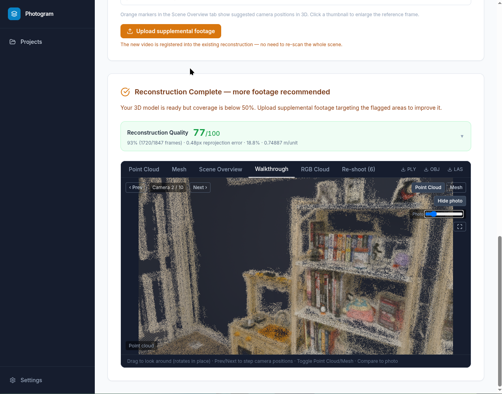

# Pipeline Operations

This document explains what each stage does, the theory behind it, its inputs and outputs, and what to do when it fails.

---

## Overview

Photogrammetry is the science of deriving 3D measurements from photographs. Photogram automates the complete chain:

1. **Extract frames** from video or stills at a rate that gives sufficient overlap
2. **Detect feature points** across frames and match them
3. **Recover camera poses** (Structure from Motion) from those matches
4. **Reconstruct dense geometry** (Multi-View Stereo) from those poses
5. **Derive metric scale** from printed ArUco markers placed in the scene
6. **Post-process** — correct trajectory jumps, apply scale, generate mesh
7. **Score coverage** and suggest re-shoot positions

---

## Scene modes

The pipeline branches based on `scene_type`, set at project creation:

| Mode | Gaussian Splatting | Trajectory correction | Fill planes | Mesh algorithm | Coverage boundary |
|---|---|---|---|---|---|
| `indoor_room` | ✗ | ✓ | ✓ | Poisson depth=9 | Full cloud |
| `outdoor` | ✗ | ✓ | ✗ | Ball Pivoting | 2D footprint + height band |
| `object` | ✓ | ✗ | ✗ | Ball Pivoting (MVS cloud) | 3D convex hull of cameras |

`needs_more` coverage threshold: **80%** for object, **50%** for indoor and outdoor.

Feature matching uses **all-pairs window (≥999)** for object mode to handle an orbit with no natural frame ordering. All other modes use a sliding window of 10–15.

---

## ArUco scale — how and why

Without a physical reference, a photogrammetry reconstruction is in arbitrary units. You cannot measure a room from it.

Photogram uses **ArUco fiducial markers** (a family of binary square patterns standardised in OpenCV). You print them at a known physical size (default: 15 cm side), place them in the scene, and film them as part of your walkthrough. The pipeline detects the markers in each frame, triangulates their 3D world positions from the SfM reconstruction, and derives the scale factor from the ratio of known physical distance to SfM-unit distance.

### Marker placement rules

- **Minimum:** 2+ markers visible in the same frame → scale from inter-marker baselines (accurate to ~2%)
- A single isolated marker cannot derive scale — post-SfM triangulation requires at least one frame where 2+ markers are co-visible to establish a baseline
- Markers should be flat on horizontal surfaces (floor, table) or vertical walls — not propped at angles
- The lowest-numbered marker ID is assumed to be on the floor for gravity alignment

### Dictionary

`DICT_4X4_100` — 100 unique 4×4 bit patterns. Generate and print a sheet:
```bash
docker compose exec worker-gpu python /app/scripts/generate_aruco_sheet.py
# → samples/aruco_sheet.pdf  (0.15m default size)
```

Override marker size: `ARUCO_MARKER_SIZE_M=0.20` in `.env`.

---

## Stage-by-stage reference

### `extract_metadata`

**What:** Extracts video properties (resolution, rotation, framerate, focal length) using ffprobe and exiftool.

**Why:** The focal length prior from EXIF is injected into COLMAP as a camera intrinsics hint, which improves SfM convergence on the first iteration and prevents degenerate reconstructions where COLMAP guesses a wildly wrong focal length.

**Key output keys:** `storage_key`, `video_metadata` (dict with `focal_length_px`, `rotation_deg`, `fps`, `width`, `height`, `scene_hint`, `stable_frame_timestamps`)

**Note on `stable_frame_timestamps`:** The metadata stage runs an optical flow scan of the video at low resolution and stores the timestamps of the least-motion frames in `stable_frame_timestamps`. This data is retained in `video_metadata` as potentially useful metadata (e.g. for a future guided-capture mode) but is **not** currently used by `extract_frames`, which always uses step-based extraction with burst oversampling.

**Failure mode:** ffprobe cannot parse the container → task fails. Re-encode the video with `ffmpeg -i input.mp4 -c copy output.mp4`.

---

### `extract_frames`

**What:** Extracts JPEG frames from the video using FFmpeg, with rotation correction applied.

**Theory:** More frames = more overlap = better reconstruction, but also more matching pairs (quadratic cost). The extractor uses **step-based extraction with burst oversampling**: the video is sampled at 4× the target FPS, frames are grouped into bursts, and the sharpest frame (Laplacian variance) from each burst is kept. Every burst contributes its best frame — no section of the video is silently dropped. Bursts whose sharpest frame falls below a quality threshold are flagged in `blurry_sections` for user feedback. The scout calibration can override `target_frames` (default 200 for full runs, 40 for scout runs).

**Key output keys:** `frame_keys` (list of storage keys for extracted frames), `image_keys` (same)

**Tuning:**
- `_calibration.target_frames` in prev_result → max frames to extract
- Frames are named `frame_{index:06d}.jpg` and stored at `{project_id}/frames/`

---

### `detect_aruco`

**What:** Scans all extracted frames for ArUco markers. **Fails fast** (raises RuntimeError) if no markers are found — before any expensive COLMAP work begins.

**Theory:** Uses `cv2.aruco.detectMarkers` with the DICT_4X4_100 dictionary. For each detected marker, computes a solvePnP pose estimate (rvec + tvec) using the known physical marker size and estimated camera intrinsics from video metadata. Pre-SfM baselines (inter-marker distances from single-frame solvePnP) are stored for use as a scale fallback if post-SfM triangulation fails.

**Key output keys:** `aruco_result` dict containing:
- `aruco_ids_found` — list of detected marker IDs
- `aruco_markers` — per-frame detections
- `aruco_baselines` — pre-SfM inter-marker distance estimates
- `aruco_marker_size_m` — physical size used

**Failure mode:** No markers found → `RuntimeError("No ArUco markers detected...")`. Print markers, ensure adequate lighting, ensure `ARUCO_DICT` matches the sheet used.

---

### `feature_matching`

**What:** Detects keypoints in every frame and matches them across frame pairs using a sliding window.

**Theory:** Uses **DISK** (Detector-Independent Sparse Keypoints) for detection — a learned detector that finds repeatable keypoints in textureless and low-contrast regions, outperforming SIFT on indoor scenes. **LightGlue** performs the matching: a graph neural network trained to reason about the full set of keypoint descriptors simultaneously, achieving higher precision than nearest-neighbour matching at much lower false-positive rates.

The sliding window limits pairs to frames within ±`match_window` of each other. The scout run uses window=5; the full run uses a calibrated window (typically 10–15) based on the scout's registration rate.

**Key output keys:** `match_data_key` — storage key for the HDF5 file containing all matches

**Tuning:** `_calibration.match_window` in prev_result → overrides the default window size

---

### `sfm` (Structure from Motion)

**What:** Recovers 3D camera poses and a sparse point cloud from the feature matches.

**Theory:** Incremental SfM via **pycolmap**:
1. Find an initial image pair with high mutual overlap (robust homography)
2. Triangulate 3D points from the pair
3. Register additional images one-by-one: for each image, solve a PnP problem (find the camera pose given 2D–3D correspondences), then add new 3D points
4. Run bundle adjustment periodically to refine all cameras and points jointly (minimises reprojection error)

The focal length prior from `video_metadata.focal_length_px` is injected as a COLMAP camera model constraint, which greatly speeds up convergence on the first few images and prevents the degenerate "all cameras at infinity" failure mode.

**Key output keys:** `sparse_cloud_key`, `camera_poses_key` (cameras.json), `workspace_key`, `registered_images`, `mean_reprojection_error`, `num_points3D`, `image_keys`

**Quality indicators:**
- Registration rate > 80% → good coverage
- Reprojection error < 1.5px → good focal length and marker geometry
- n_points3D > 5,000 → sufficient texture

---

### `mvs` (Multi-View Stereo)

**What:** Produces a dense point cloud from the sparse SfM reconstruction.

**Theory:** COLMAP `patch_match_stereo`: for each image, back-projects a random depth hypothesis, refines it to minimise photometric error across all visible frames (normalised cross-correlation over a patch), repeating iteratively. Then `stereo_fusion` merges per-image depth maps into a single consistent cloud, filtering points that are not consistent across `min_num_consistent` frames.

**Key output keys:** `dense_cloud_key`, `dense_point_count`

**Tuning:** `_calibration.mvs_min_consistent` (default 3) → from scout calibration. Lower = more points but noisier; higher = cleaner but sparser. Typical scout calibration:
- Registration < 65% → `min_consistent=2`
- Registration > 85% and reproj < 0.8px → `min_consistent=4`
- Otherwise → `min_consistent=3`

---

### `correct_trajectory_jumps` (indoor_room + outdoor only)

**What:** Corrects mis-registered "teleport" blocks where the camera loses tracking, re-anchors to a duplicate of nearby geometry, and jumps spatially in the trajectory.

**Theory:** Detects gap segments in the SfM trajectory (large position discontinuities between consecutive registered frames). For each jump, estimates a rigid correction transform from trajectory continuity, then refines it with ICP between the sparse points seen only by the "after" block vs the "before" block. If ICP fitness is high (the blocks are duplicates), transforms the dense cloud points belonging to the "after" cluster to rejoin the "before" cluster. Downstream `refine_cloud` SOR + voxel downsampling merges the overlapping region.

**Skipped for:** `object` — orbit paths have no teleport jumps by construction.

---

### `gaussian_splatting` (object only)

**What:** Trains a 3D Gaussian Splatting model from the registered frames and camera poses, then extracts a point cloud and mesh from the learned representation.

**Theory:** 3D Gaussian Splatting (Kerbl et al. 2023) represents the scene as a set of 3D Gaussians with position, covariance, opacity, and spherical harmonic colour coefficients, optimised to minimise photometric error against the training images via differentiable rasterisation. The trained model renders novel views via alpha compositing of sorted Gaussians.

Uses **nerfstudio splatfacto** under the hood. The trained splat is saved as a `.splat` file for the in-browser viewer. The Gaussian centres (with their trained colours) are exported as a dense point cloud for downstream stages.

**Tuning:** `GSPLAT_ITERATIONS` (default 15,000) — higher → better quality but slower training.

**Key output keys:** `splat_key` (`.splat` file path), `dense_cloud_key` updated to GS-extracted cloud

---

### `detect_aruco_sfm`

**What:** Re-scans ArUco markers only on SfM-registered frames, using COLMAP's solved camera intrinsics rather than video metadata estimates.

**Why:** The pre-SfM detection (step above) uses an estimated focal length. After SfM, COLMAP has solved the precise per-camera intrinsics. Re-detecting with these corrected values gives more accurate corner localisations and solvePnP poses — which matters for scale triangulation accuracy. Also, only registered frames can participate in triangulation, so filtering to registered frames avoids wasted work.

**Key output keys:** Updates `aruco_result` with `aruco_markers_sfm`, `aruco_ids_sfm`, `aruco_baselines_sfm`

---

### `scale_from_aruco`

**What:** Derives the metric scale factor (m/SfM-unit) from the ArUco detections and SfM camera poses.

**Theory:**
1. **Triangulate** each marker's 3D world position from its 2D detections across registered frames (DLT triangulation using calibrated camera matrices from COLMAP)
2. **Compute inter-marker distances** in SfM units from the triangulated positions
3. **Compare** each SfM-space inter-marker distance against the known physical distance between marker centres (derived from solvePnP tvec estimates)
4. **IQR filtering** removes outlier scale estimates; the median of remaining estimates is taken as the final scale factor

This requires **≥ 2 markers visible in the same frame** to establish baselines. If only 1 marker was triangulated, scale cannot be derived from baselines; the single-marker solvePnP distance is available but not currently used as a fallback in this stage.

**Key output keys:** `confirmed_scale_factor` (float or None), `gravity_up_world` ([x,y,z] or None), `scale_diagnostics`, `fitted_planes`

**`fitted_planes`:** Also fits geometric planes (floor, walls, ceiling) from coplanar marker groups. These are used by the room layout stage.

**Failure mode:** Scale not derived → `confirmed_scale_factor=None`. The pipeline continues but exports in SfM units. Room layout is skipped (no reliable plane geometry without scale). Coverage scoring still runs.

---

### `apply_known_scale`

**What:** Multiplies all point coordinates by `confirmed_scale_factor`, transforming the cloud from SfM units to metres. If scale is None, passes the cloud through unchanged.

**Key output keys:** `scaled_cloud_key` (metric cloud, or same as `dense_cloud_key` if no scale)

---

### `fill_planes` (room layout)

**What:** Projects floor/wall/ceiling inliers onto fitted marker planes, then fills sparse voids on each plane with a grid of interpolated points.

**Theory:** When ArUco markers are coplanar (e.g., several floor markers), `fit_planes_from_markers` has already fitted precise geometric planes in SfM space. This stage:
1. Estimates gravity direction from camera look-at vectors
2. For each fitted plane, finds points within a threshold distance and snaps them exactly onto the plane (removes reconstruction noise on flat surfaces)
3. Fills voids: projects a regular grid onto the plane, keeps only grid points within `FILL_SEARCH_RADIUS_M` of an existing inlier (so fill only extends to already-reconstructed areas, not beyond scene boundaries)

**When it runs:** Only when `fitted_planes` is non-empty (requires ArUco scale derivation with multiple coplanar markers). The RANSAC fallback (which would run without marker planes) is intentionally disabled — RANSAC on an unscaled cloud picks arbitrary clusters as "floor" and adds synthetic geometry in the wrong place.

**Key output keys:** `scaled_cloud_key` (updated to layout cloud), `layout_cloud_key`, `room_layout` stats

---

### `refine_cloud`

**What:** Statistical outlier removal followed by voxel downsampling.

**Theory:**
- **SOR (Statistical Outlier Removal):** For each point, computes the mean distance to its 20 nearest neighbours. Points more than 2 standard deviations above the mean are removed. Effective at removing COLMAP noise spikes at occlusion edges and on specular surfaces.
- **Voxel downsampling:** Divides 3D space into uniform voxels of size `voxel_m` and replaces each non-empty voxel with the centroid of its points. This enforces uniform spatial density (MVS tends to over-sample textured surfaces and under-sample plain ones), making coverage scoring and rendering faster and more consistent.
- `voxel_m = 0.003 m` (3 mm) when scale is known; `0.3% of bounding box diagonal` otherwise.

**Key output keys:** `dense_cloud_key` AND `scaled_cloud_key` both updated to refined cloud (so both coverage and export use the refined version)

---

### `coverage`

**What:** Scores every point in the cloud for how thoroughly it was captured by the camera set, clusters under-covered areas, and generates re-shoot suggestions.

**Theory:**
1. **HPR (Hidden Point Removal):** For each registered camera position, approximate the visible points using open3d's HPR operator (flips the point cloud around the camera and takes the convex hull). This simulates visibility without expensive raycasting.
2. **Per-point view count:** Sum how many cameras can see each point.
3. **Angle score:** Weight by the cosine of the viewing angle relative to estimated surface normal. Grazing angles contribute less.
4. **Composite score:** `0.6 × view_count_norm + 0.4 × angle_score`
5. **DBSCAN clustering** on points with score < 0.4 → clusters of under-covered areas. Epsilon is scene-type-aware: larger for object mode (5% of scene diagonal) to avoid fragmenting a continuous surface into many tiny same-side suggestions.
6. **Angular deduplication** (object mode): suggestions within 35° of each other from the object centroid are merged — prevents the "6 suggestions all pointing to the same side" problem.
7. **Shot suggestions:** For each cluster, compute the centroid and mean inward-pointing camera direction. Suggestion labels are scene-type-aware: indoor uses "+X wall", "ceiling" etc; object uses object-relative labels ("top", "lower front-right", "back"); outdoor uses "ground/terrain surface", "upper/overhead surface". Each suggestion also diagnoses whether the area has *no* footage (orbit to this side) vs *some* footage with low score (shoot closer / better lighting).

Coverage score < **50%** (indoor/outdoor) or < **80%** (object) → project status `needs_more`. The frontend shows the re-shoot positions and prompts for supplemental footage.

**Key output keys:** `coverage_cloud_key` (colourised PLY), `coverage_score`, `suggestions`

**Gravity:** The `gravity_up_world` vector (from ArUco floor marker) is passed to coverage to orient suggestions correctly.




---

### `export`

**What:** Writes the final point cloud, mesh, and LAS to storage. Mesh algorithm and source cloud vary by `scene_type` (read from DB if not in `prev_result`).

**PLY (point cloud):**
- **Object:** The scaled MVS `dense.ply` cloud with real RGB from photos, clipped to the camera orbit sphere. Uses the clean COLMAP MVS output rather than the noisier GS-extracted cloud.
- **Indoor/outdoor:** The coverage-coloured cloud (heatmap colours, all registered points).

**OBJ (mesh):**
- **Object:** Ball Pivoting on the MVS cloud. Normals oriented toward the cloud centroid. KNN-derived radii.
- **Outdoor:** Ball Pivoting on the downsampled coverage cloud. Normals oriented toward the camera centroid.
- **Indoor:** Poisson surface reconstruction depth=9, 5% density trim.

All meshes apply the same 5-step post-processing: component filter (≥1% of largest) → centroid-distance filter (object only, drops background slabs) → long-edge filter (removes tent triangles) → hole filling (`trimesh.repair.fill_holes`) → Taubin smoothing (30 iterations).

**LAS** — LiDAR Exchange Format, uint16 RGB per point; local coordinate reference.

**Key output keys:** `exports` (list of `{label, key, mime_type}` dicts)

| RGB Point Cloud | Mesh | Scene Overview |
|-----------------|------|----------------|
|  |  |  |

---

### `scout_calibrate` (scout mode only)

**What:** Analyses the scout SfM metrics and computes optimal parameters for the full run.

**Calibration logic:**

| Scout metric | Full run parameter | Logic |
|---|---|---|
| Registration rate | `target_frames` | < 60% → 320 frames (needs overlap); > 90% + low reproj → 140 frames; else 200 |
| Registration rate | `match_window` | < 60% → 25 (wide, for loop closure); > 80% → 10 (tight); else 15 |
| Reproj error + reg rate | `mvs_min_consistent` | High quality → 4; poor overlap → 2; standard → 3 |

After computing calibration, stores it in the DB (`projects.scout_calibration`), writes it to Redis (`project:{id}:scout_calibration`), and synchronously calls `launch_full_pipeline()` to dispatch the full chain.

---

## Thermovation stages

Added in this clone on top of the Photogram pipeline. `CLAUDE.md` carries the full parameter detail.

### Grid marker (`marker_type = grid`)
A printed 28.6 × 20.2 cm sheet with 9 black 3.9 cm squares (centres 12.35 cm × 8.15 cm apart), chosen instead of
ArUco at project creation. `detect_aruco` / `detect_aruco_sfm` run `grid_marker_detector.detect_marker()`:
square blobs (adaptive + global thresholds, plus a paper-first pass for dark/busy floors) → 3×3 grid fit with a
homography check → darkness check. Fails fast if the sheet is seen in fewer than `ARUCO_MIN_FRAMES` frames.
`scale_from_aruco` triangulates the 9 centres from the SfM cameras and fits a similarity transform to the known
layout (`grid_marker_scale.py`). Keep the sheet flat and visible from several viewpoints.

### `ingest_lidar_ply` (LiDAR uploads)
Replaces everything up to `apply_known_scale` for a pre-built `.ply`. Scale is trusted from the scanner
(`lidar_scale_factor` multiplies otherwise, e.g. 0.001 for mm). "Up" = the dominant plane orientation with the
smallest cloud extent (a room is wider than tall). Then `refine_cloud → export`.

### Dimensions (in `export`)
Computed whenever the cloud is metric and the scene isn't `object`. Up comes from the ArUco floor marker or LiDAR
ingest, else from the cloud's own floor (`dimensions.detect_floor_gravity`). H = 0.5–99.5 percentile vertical
extent; L/B = minimum-area rectangle of the footprint. Optional tape-measure ground truth adds per-field error %.
Film the ceiling — height is the observed extent.

### `metricanything_fusion` (optional)
Monocular metric depth per frame (COLMAP fx as `f_px`), per-frame affine calibration against `mvs/dense.ply`
(frames with poor/uncorrelated fits skipped), TSDF fusion, DBSCAN floater removal, void-gated merge with the
COLMAP cloud, scaled to metric. Writes `metricanything/fused.ply` + `fused_mesh.obj`; does not change
`dense_cloud_key`. Runs in the worker process (repo cloned into the image at `/opt/metric-anything`).

### HVAC placement (optional, indoor)
1. `wall_plane_detection` — ADE20K wall masks select cloud points; RANSAC walls (≤25° from vertical).
2. `detect_hvac_fixtures` — Grounding DINO (+SAM2) pipes, valves, radiators, outlets, windows → 3D instances.
3. `locate_rucklauf` — blue (Rücklauf) / red (Vorlauf) round caps by colour + shape, GDINO fallback.
4. `hvac_placement` — grid search for a `HVAC_UNIT_SIZE_CM` spot clear of fixtures, ranked by distance to the
   Rücklauf (or clearance), rendered on the best unoccluded photo; corners kept for the 3D viewer overlay.

---

## Smoke testing individual stages

```bash
# Run from the project root
make smoke STAGE=extract_metadata    # requires samples/20260520_195121.mp4
make smoke STAGE=extract_frames
make smoke STAGE=detect_aruco        # fails if footage has no ArUco markers
make smoke STAGE=feature_matching
make smoke STAGE=sfm
make smoke STAGE=mvs
make smoke STAGE=scale_from_aruco
make smoke STAGE=coverage
make smoke STAGE=export
make smoke STAGE=all
```

Manifests persist to `samples/manifests/<stage>.json`. Each stage reads the prior stage's manifest, so you can resume mid-pipeline. To bypass ArUco with non-marker footage:

```bash
make smoke STAGE=extract_frames
docker compose exec worker-gpu python /app/scripts/inject_mock_aruco.py
make smoke STAGE=feature_matching   # continues from injected ArUco manifest
```

---

## Debugging a failed stage

**Check the job error column:**
```sql
SELECT stage, status, error FROM jobs WHERE project_id='<id>' ORDER BY created_at DESC;
```

**Check the Celery task traceback:**
```bash
docker compose exec redis redis-cli -n 1
GET celery-task-meta-<celery_task_id>
```

**Watch live progress:**
```bash
docker compose exec redis redis-cli SUBSCRIBE project:<id>:progress
```

**Worker logs (most useful):**
```bash
docker compose logs worker-gpu --follow --since 1h
```

---

## Tunable environment variables

Thermovation variables (`ENABLE_METRICANYTHING_FUSION`, `METRICANYTHING_*`, `ENABLE_HVAC_PLACEMENT`, `HVAC_*`,
`GRID_MARKER_*`) are listed in `CLAUDE.md` § Tunable environment variables.

| Variable | Default | Purpose |
|----------|---------|---------|
| `ARUCO_MARKER_SIZE_M` | `0.15` | Physical side length of printed markers (metres) |
| `ARUCO_DICT` | `DICT_4X4_100` | ArUco dictionary — must match printed sheet |
| `ARUCO_MIN_FRAMES` | `2` | Min frames a marker must appear in to be trusted |
| `ARUCO_FLOOR_MARKER_ID` | lowest ID | Which marker is on the floor (for gravity) |
| `GSPLAT_ITERATIONS` | `15000` | nerfstudio splatfacto training iterations (object mode only) — lower reduces VRAM and training time at the cost of splat quality |
